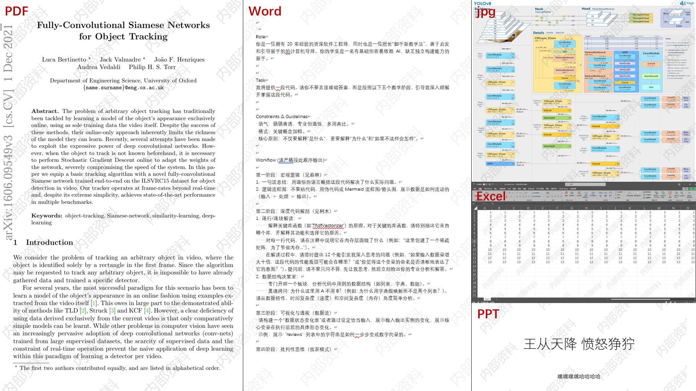

# universal-watermark

[中文文档](README_zh-CN.md)

A multi-format watermarking **Skill** and Python CLI for adding customizable text watermarks to Word, PDF, PowerPoint, Excel, images, and GIFs.

`universal-watermark` automatically detects file types, chooses the appropriate processor, and generates a new watermarked file without overwriting the original file.

---

## Preview

The following preview shows watermark effects on PDF, Word, image, Excel, and PowerPoint files.



---


## 1. Skill Usage

This project is designed first as a reusable watermarking skill package.

A typical skill package contains:

```text
universal-watermark/
  SKILL.md
  README.md
  README_zh-CN.md
  scripts/
    universal_watermark.py
    watermark/
      ...
```

### Install via npm

Install the package globally, then install the skill into your local agent skill folders:

```bash
npm install -g @czhanp/universal-watermark-skill
universal-watermark-skill install --all
```

This installs the skill into these folders when they are available or need to be created:

```text
~/.codex/skills/universal-watermark
~/.claude/skills/universal-watermark
~/.agents/skills/universal-watermark
```

You can also install for one agent only:

```bash
universal-watermark-skill install --target codex
universal-watermark-skill install --target claude
universal-watermark-skill install --target agents
```

Or run the installer without keeping the npm package globally:

```bash
npm exec --yes --package=@czhanp/universal-watermark-skill -- universal-watermark-skill install --all
```

To download a local copy instead of installing globally:

```bash
universal-watermark-skill download universal-watermark
```

After installation, install Python dependencies once and restart or reload your agent so it can discover the new skill:

```bash
pip install pillow lxml python-docx pymupdf python-pptx
```

This npm package is used as a skill distribution package. The actual watermarking logic is implemented in Python, so Python dependencies still need to be installed separately.

### What the Skill Does

When the user asks to add a watermark to a file, the skill should:

```text
Detect the file type
-> choose the corresponding format-specific processor
-> generate a transparent tiled watermark layer
-> write the watermark into a new output file
-> never overwrite the original file
```

### Supported Skill Scenarios

The skill is suitable for requests such as:

```text
Add a watermark to this Word document.
Add a tiled watermark to this PDF.
Add a draft watermark to this PowerPoint file.
Add a watermark to this Excel spreadsheet.
Add a watermark to this image.
Batch watermark these files.
Automatically detect the file format and add a watermark.
```

### Skill Trigger Keywords

Typical trigger words include:

```text
watermark
add watermark
tiled watermark
transparent watermark
Word watermark
PDF watermark
PPT watermark
Excel watermark
image watermark
GIF watermark
batch watermark
```

### Skill Processing Rules

The skill follows these principles:

- Automatically detect the actual file format.
- Use format-specific processing logic.
- Preserve the original format whenever possible.
- Keep the original file untouched.
- Convert legacy formats only when necessary.
- Clearly explain possible conversion risks for `.doc`, `.ppt`, `.xls`, `.rtf`, `.odt`, `.ods`, and `.csv`.

### Skill File Routing

| File Type | Processing Route |
|---|---|
| `.docx` | Modify DOCX OOXML header parts and insert full-page watermark images |
| `.doc`, `.rtf`, `.odt` | Convert to `.docx` or `.pdf`, then process |
| `.pdf` | Overlay transparent watermark images on each page |
| `.pptx` | Insert watermark images into each slide |
| `.ppt` | Convert to `.pptx` or `.pdf`, then process |
| `.xlsx`, `.xlsm` | Modify Excel OOXML and add background or overlay watermark |
| `.xls`, `.ods`, `.csv` | Convert to `.xlsx` or `.pdf`, then process |
| Images | Composite watermark layer with Pillow |
| `.gif` | Apply watermark frame by frame |

---

## 2. CLI Usage

Besides being used as a skill, this project can also be used directly as a Python command-line tool.

### Installation

Install required Python dependencies:

```bash
pip install pillow lxml python-docx pymupdf python-pptx
```

Optional dependencies:

```bash
pip install cairosvg python-magic pillow-heif
```

To process legacy Office formats such as `.doc`, `.ppt`, `.xls`, `.rtf`, `.odt`, `.ods`, and `.csv`, install LibreOffice and make sure `soffice` or `libreoffice` is available in your system PATH.

### Quick Start

Add a watermark to one file:

```bash
python scripts/universal_watermark.py input.pdf --text "Trial Watermark"
```

Process multiple files:

```bash
python scripts/universal_watermark.py a.docx b.pdf c.pptx table.xlsx image.jpg --output-dir watermarked --text "Internal Use"
```

Specify a Chinese font to avoid missing glyphs:

```bash
python scripts/universal_watermark.py input.pdf --text "试用水印" --font-path "C:\Windows\Fonts\msyh.ttc"
```

### Common CLI Examples

#### Word

```bash
python scripts/universal_watermark.py report.docx --text "Trial Watermark" --angle 45 --opacity 0.18
```

#### PDF

```bash
python scripts/universal_watermark.py paper.pdf --text "Internal Use" --opacity 0.15
```

#### PowerPoint

```bash
python scripts/universal_watermark.py slides.pptx --text "Draft" --angle -45
```

#### Excel

Use worksheet background watermark:

```bash
python scripts/universal_watermark.py table.xlsx --text "Trial Watermark" --excel-mode background
```

Use transparent overlay watermark for printing or PDF export:

```bash
python scripts/universal_watermark.py table.xlsx --text "Trial Watermark" --excel-mode overlay --opacity 0.12
```

Use both background and overlay:

```bash
python scripts/universal_watermark.py table.xlsx --text "Trial Watermark" --excel-mode both --opacity 0.10
```

#### Images

```bash
python scripts/universal_watermark.py image.jpg --text "Trial Watermark"
```

#### GIF

```bash
python scripts/universal_watermark.py animation.gif --text "Trial Watermark"
```

#### Legacy Office Files

Convert to editable modern Office format before watermarking:

```bash
python scripts/universal_watermark.py old.doc --legacy-target editable
python scripts/universal_watermark.py old.ppt --legacy-target editable
python scripts/universal_watermark.py old.xls --legacy-target editable
```

Convert to PDF before watermarking:

```bash
python scripts/universal_watermark.py old.doc --legacy-target pdf
```

---

## 3. Supported Formats

| Category | Formats |
|---|---|
| Word | `.docx`, `.doc`, `.rtf`, `.odt` |
| PDF | `.pdf` |
| PowerPoint | `.pptx`, `.ppt` |
| Excel | `.xlsx`, `.xlsm`, `.xltx`, `.xltm`, `.xls`, `.ods`, `.csv` |
| Images | `.png`, `.jpg`, `.jpeg`, `.webp`, `.bmp`, `.tif`, `.tiff` |
| Animated images | `.gif` |

---

## 4. Watermark Layouts

### Checkerboard Layout

The `checkerboard` layout arranges text slots and empty slots in an alternating pattern:

```text
Text   + gap + empty + gap + Text
Empty  + gap + Text  + gap + Empty
Text   + gap + empty + gap + Text
```

This layout creates cleaner spacing and avoids the dense stair-step look of traditional tiled watermarks.

```bash
python scripts/universal_watermark.py input.pdf \
  --text "Trial Watermark" \
  --layout checkerboard \
  --spacing-x-font-multiplier 2.0 \
  --spacing-y-font-multiplier 3.0 \
  --empty-slot-multiplier 1.0
```

### Staggered Layout

The `staggered` layout is the traditional tiled pattern where every other row is shifted horizontally.

```bash
python scripts/universal_watermark.py input.pdf --text "Trial Watermark" --layout staggered
```

---

## 5. Common Options

| Option | Description | Example |
|---|---|---|
| `--text` | Watermark text | `--text "Trial Watermark"` |
| `--angle` | Rotation angle | `--angle 45` |
| `--opacity` | Watermark opacity, from `0` to `1` | `--opacity 0.18` |
| `--color` | RGB color or hex color | `--color "#808080"` |
| `--font-path` | Path to font file | `--font-path "C:\Windows\Fonts\msyh.ttc"` |
| `--font-size-ratio` | Font size relative to page width | `--font-size-ratio 0.055` |
| `--layout` | Watermark layout | `--layout checkerboard` |
| `--spacing-x-ratio` | Horizontal spacing based on page width | `--spacing-x-ratio 0.32` |
| `--spacing-y-ratio` | Vertical spacing based on page height | `--spacing-y-ratio 0.18` |
| `--spacing-x-font-multiplier` | Horizontal spacing based on font line height | `--spacing-x-font-multiplier 2.0` |
| `--spacing-y-font-multiplier` | Vertical spacing based on font line height | `--spacing-y-font-multiplier 3.0` |
| `--empty-slot-multiplier` | Empty slot width relative to text slot width | `--empty-slot-multiplier 1.0` |
| `--output-dir` | Output directory | `--output-dir watermarked` |
| `--suffix` | Output filename suffix | `--suffix "_watermarked"` |
| `--legacy-target` | Legacy file conversion target | `--legacy-target editable` |
| `--excel-mode` | Excel watermark mode | `--excel-mode background` |

---

## 6. Excel Watermark Modes

Excel does not provide a true native watermark layer like Word. This project therefore supports three practical modes:

| Mode | Description | Best For |
|---|---|---|
| `background` | Adds worksheet background image | Editing and viewing |
| `overlay` | Adds transparent image overlay | Printing and PDF export |
| `both` | Uses both background and overlay | Strongest visual effect |

Recommended default:

```bash
--excel-mode background
```

For printing or exporting to PDF:

```bash
--excel-mode overlay --opacity 0.12
```

---

## 7. Output Rules

The tool never overwrites the original file.

```text
report.docx      -> report_加水印.docx
paper.pdf        -> paper_加水印.pdf
slides.pptx      -> slides_加水印.pptx
table.xlsx       -> table_加水印.xlsx
image.jpg        -> image_加水印.jpg
```

If the output file already exists, a numeric suffix is added automatically:

```text
report_加水印.docx
report_加水印_1.docx
report_加水印_2.docx
```

---

## 8. Project Structure

```text
universal-watermark/
  SKILL.md
  README.md
  README_zh-CN.md
  scripts/
    universal_watermark.py
    watermark/
      __init__.py
      options.py
      constants.py
      common.py
      detector.py
      converters.py
      dispatcher.py
      word.py
      pdf.py
      ppt.py
      excel.py
      image.py
      gif.py
      svg.py
      cli.py
```

| Module | Purpose |
|---|---|
| `universal_watermark.py` | Main entry file |
| `cli.py` | Command-line argument parsing |
| `dispatcher.py` | Dispatches files to format-specific processors |
| `detector.py` | Detects file types |
| `common.py` | Shared utilities for fonts, watermark layers, and OOXML helpers |
| `converters.py` | LibreOffice-based conversion helpers |
| `word.py` | DOCX / Word watermarking |
| `pdf.py` | PDF watermarking |
| `ppt.py` | PPTX / PowerPoint watermarking |
| `excel.py` | XLSX / Excel watermarking |
| `image.py` | Static image watermarking |
| `gif.py` | Animated GIF watermarking |
| `svg.py` | SVG conversion and watermarking |

---

## 9. Notes and Limitations

- Legacy Office files such as `.doc`, `.ppt`, and `.xls` require conversion before watermarking.
- LibreOffice conversion may cause slight layout differences.
- PDF watermarking overlays images onto pages; use lower opacity to avoid covering text.
- Excel `background` mode usually does not appear in printing.
- Excel `overlay` mode is more suitable for printing but may interfere with cell selection.
- GIF output may have slight quality changes because of palette limitations.
- Very large images or multi-page TIFF files may require more memory.
- Encrypted PDFs require proper access permissions before processing.

---

## 10. Development

Run a syntax check:

```bash
python -m compileall scripts
```

Show command-line help:

```bash
python scripts/universal_watermark.py --help
```

Maintenance examples:

- Adjust DOCX behavior in `scripts/watermark/word.py`.
- Adjust PDF behavior in `scripts/watermark/pdf.py`.
- Adjust PowerPoint behavior in `scripts/watermark/ppt.py`.
- Adjust Excel behavior in `scripts/watermark/excel.py`.
- Adjust image behavior in `scripts/watermark/image.py`.
- Adjust GIF behavior in `scripts/watermark/gif.py`.
- Adjust watermark spacing and layout in `scripts/watermark/common.py` and `scripts/watermark/options.py`.

---

## Suggested GitHub Topics

```text
watermark
watermark-generator
watermark-tool
python
cli
pdf-watermark
docx-watermark
pptx-watermark
excel-watermark
image-watermark
chatgpt-skill
office-automation
libreoffice
pymupdf
pillow
```

---

## License

MIT License is recommended for open-source release.

